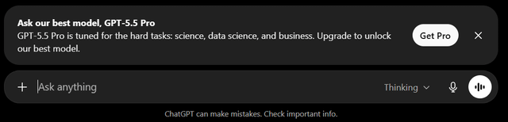

# ChatGPT Plus/Pro and Codex Pop-Up Blocker

This is a Tampermonkey userscript to hide/block ChatGPT's dismissible upsell and announcement banners (e.g. "Upgrade to Plus," "Upgrade to Pro," "Meet Codex in the desktop app") on any desktop browser.

ChatGPT renders these as banners above the message composer, and they reappear periodically no matter how many times you dismiss them. Rather than chase the wording of each new one individually, this script recognizes the underlying component ChatGPT reuses for all of them, so it catches Plus, Pro, Codex, and future promos alike, along with the standalone "Upgrade" buttons in the header and sidebar.

## Notification Example

## Installation

1. Install Tampermonkey from https://www.tampermonkey.net/ (On Chromium browsers like Google Chrome or Microsoft Edge, you will probably need to manually go into the extension's settings and set "site access" to "on all sites," along with changing "allow user scripts" to ON for any installed scripts like this to do anything)
2. Click this link: [chatgpt-hide-upgrade-nags.user.js](https://raw.githubusercontent.com/HenryKredatus/ChatGPT-Plus-Pro-and-Codex-Pop-Up-Blocker/main/chatgpt-hide-upgrade-nags.user.js) -Tampermonkey will pop up an install prompt.
3. Click Install.
4. Optional: adjust `NAG_PHRASES` or `CTA_TEXT_RE` near the top of the script if you want to catch/allow specific wording.

## How it works

ChatGPT builds every one of these dismissible promo banners (Plus, Pro, Codex, and presumably whatever comes next) from the same underlying component, so instead of matching each banner's specific copy, the script matches that shared shape. It:

1. Scans every `<aside>` element on the page and checks it for three structural markers that only appear together on these promo banners: an `<h3>` title, a "Close" button (`aria-label="Close"`), and a primary call-to-action button (matched either by its `.btn-primary` class or by its text, e.g. "Get Plus," "Upgrade to Pro," "Try Team").
2. If all three are present, hides the whole `<aside>` with `display: none !important` — both immediately via an injected CSS rule (so there's no flash before JavaScript runs) and via a JavaScript pass for anything the CSS selector doesn't catch.
3. Falls back to a plain-text phrase match (`NAG_PHRASES`, e.g. "upgrade to plus," "meet codex") for the rare case a banner ships without the full structural signature.
4. Separately hides any standalone "Upgrade" button/pill in the top-right header actions or the sidebar footer, matched by `aria-label="Upgrade"` or by exact button text ("Upgrade," "Get Plus," "Go Plus").
5. Uses a `MutationObserver` to re-run all of the above as you navigate and as ChatGPT's React app re-renders content, so newly-appearing banners get hidden without a page reload.

## NOTE

Because matching is structural rather than tied to one banner's exact wording, this should keep working on new promo banners (like a future Pro-tier one) without needing an update-but if something ever slips through, the fastest fix is grabbing that banner's HTML and adding its phrase to `NAG_PHRASES`, or opening an issue.
