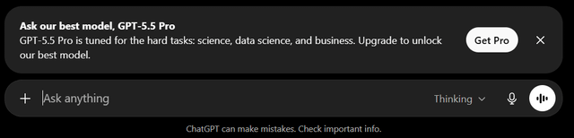

# ChatGPT Plus/Pro and Codex Pop-Up Blocker

This is a Tampermonkey userscript to hide/block ChatGPT's dismissible upsell and announcement banners (e.g. "Upgrade to Plus," "Upgrade to Pro," "Meet Codex in the desktop app") on any desktop browser.

ChatGPT renders these as banners above the message composer, and they reappear periodically no matter how many times you dismiss them. Rather than chase the wording of each new one individually, this script recognizes the underlying component ChatGPT reuses for all of them, so it catches Plus, Pro, Codex, and future promos alike, along with the standalone "Upgrade" buttons in the header and sidebar.

## Notification Example

## Installation

1. Install Tampermonkey from https://www.tampermonkey.net/ (On Chromium browsers like Google Chrome or Microsoft Edge, you will probably need to manually go into the extension's settings and set "site access" to "on all sites," along with changing "allow user scripts" to ON for any installed scripts like this to do anything)
2. Click this link: [chatgpt-hide-upgrade-nags.user.js](https://raw.githubusercontent.com/HenryKredatus/ChatGPT-Plus-Pro-and-Codex-Pop-Up-Blocker/main/chatgpt-hide-upgrade-nags.user.js) -Tampermonkey will pop up an install prompt.
3. Click Install.
4. Optional: adjust `NAG_PHRASES` or `CTA_TEXT_PATTERNS` near the top of the script if you want to catch/allow specific wording.

## How it works

ChatGPT builds every one of these dismissible promo banners (Plus, Pro, Codex, and presumably whatever comes next) from the same underlying component, but its styling class names are hashed/auto-generated and change on every OpenAI deploy (e.g. `surface-NbxhOL`, `primary-FmM7e1` one day, something else entirely the next). So instead of matching class names, the script matches things OpenAI itself keeps stable — accessibility (`aria-label`) text and the general shape of the banner. It:

1. Scans every `<aside>` element on the page and checks its buttons' `aria-label` attributes. If any button is labeled as a dismiss/close control for a "banner" (OpenAI's own wording, e.g. `aria-label="Dismiss ChatGPT beacon banner"`), that's treated as a certain match on its own.
2. As a fallback, looks for the general shape these banners share even when the labeling differs: some dismiss/close button (by `aria-label`) paired with some call-to-action-looking button (matched loosely against patterns like "Get/Go/Try Plus," "Upgrade," "Try ... free," "Meet Codex," "Download the app").
3. Falls back further to a plain-text phrase match (`NAG_PHRASES`) against the banner's full text, for the rare case one ships without a recognizable dismiss or CTA button at all.
4. Hides any matched `<aside>` with `display: none !important` — both immediately via an injected CSS rule keyed on the same "banner" aria-label pattern (so there's no flash before JavaScript runs), and via a JavaScript pass for anything the CSS selector alone doesn't catch.
5. Separately hides any standalone "Upgrade" button/pill in the top-right header actions or the sidebar footer, matched by `aria-label="Upgrade"` or by exact button text ("Upgrade," "Get Plus," "Go Plus").
6. Uses a `MutationObserver` to re-run all of the above as you navigate and as ChatGPT's React app re-renders content, so newly-appearing banners get hidden without a page reload.

## NOTE

Because matching avoids ChatGPT's hashed class names entirely and leans on `aria-label` wording and loose text patterns instead, this should keep working through most future OpenAI redesigns of these banners without needing an update — but if something ever slips through, the fastest fix is grabbing that banner's HTML and adding its phrase to `NAG_PHRASES` or its CTA wording to `CTA_TEXT_PATTERNS`, or opening an issue.
